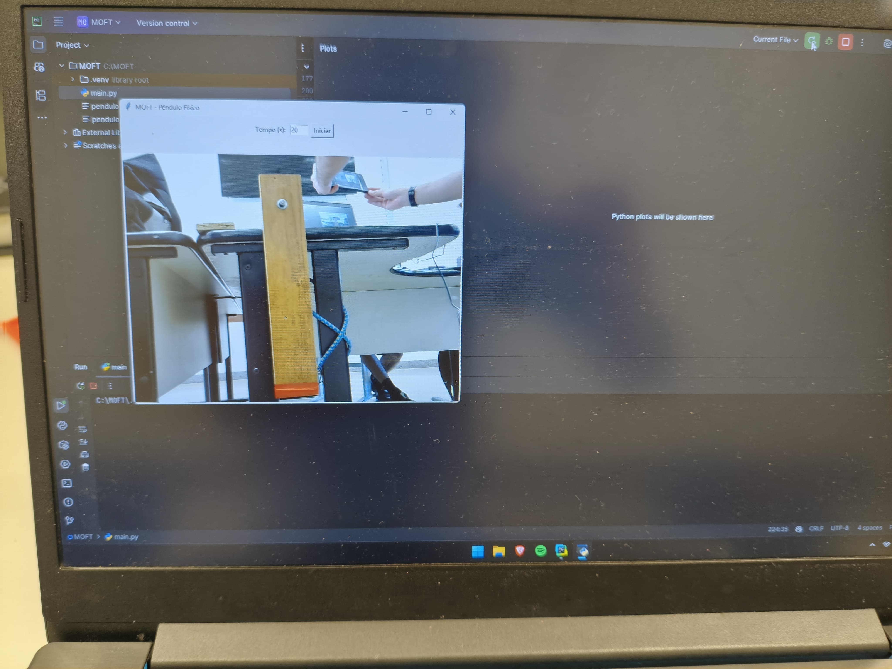
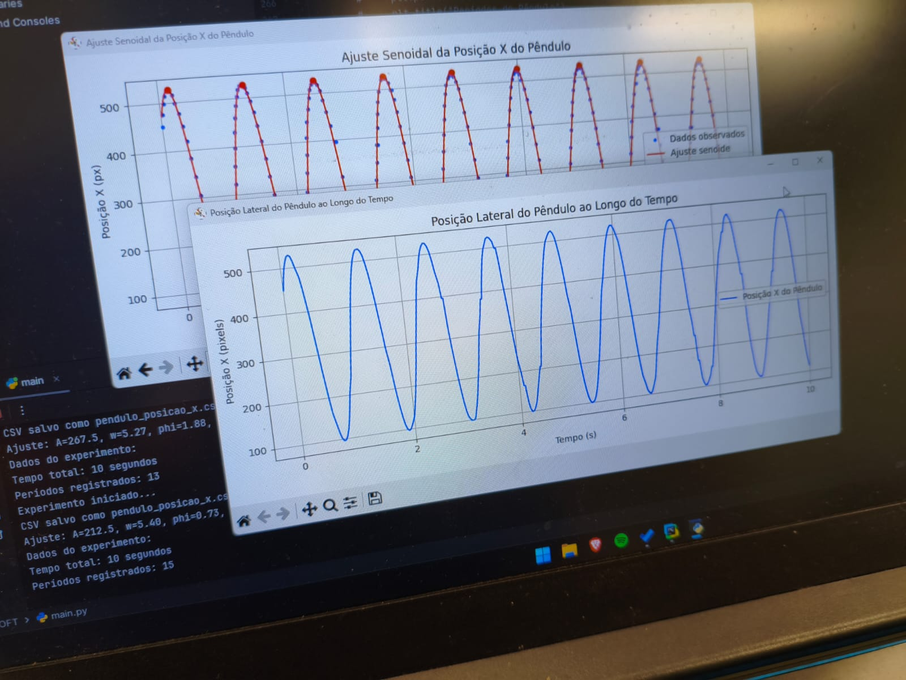
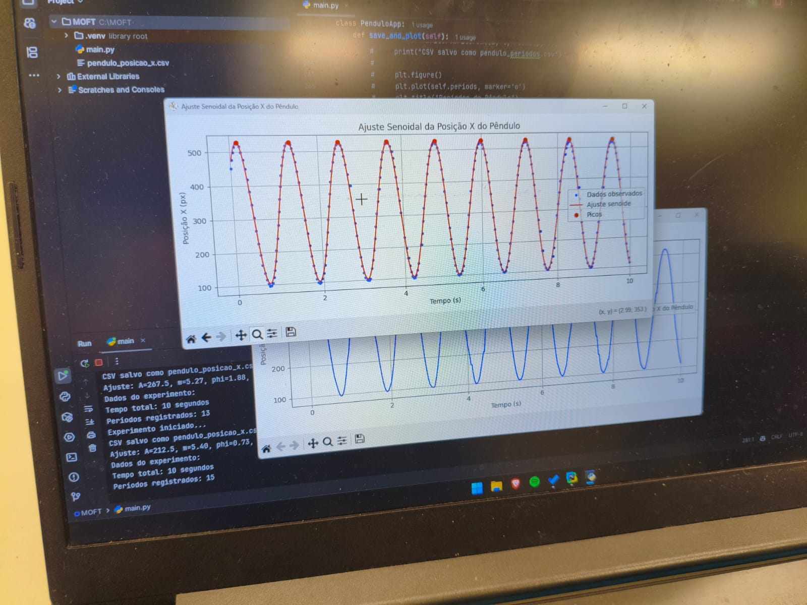

# Pêndulo Físico

Projeto para monitoramento e análise do movimento de um pêndulo físico usando visão computacional em Python.

---

## Descrição

Esse software foi desenvolvido como parte de um projeto para a aprovação na disciplina de Física Experimental I. 
O objetivo era calcular o momento de inércia de um pêndulo físico e analisar o seu movimento 
utilizando técnicas de visão computacional.

O software está configurado para rastrear vermelho, mas pode ser facilmente adaptado para rastrear outras cores.

Equação do pêndulo físico:
$$
T = 2\pi \sqrt{\frac{I}{mgh}}
$$
onde:
- \( T \) é o período de oscilação,
- \( I \) é o momento de inércia,
- \( m \) é a massa do pêndulo,
- \( g \) é a aceleração da gravidade,
- \( h \) é a altura do centro de massa do pêndulo.

---

(é possível aplicar para outros tipos de pêndulos, como o pêndulo simples)


## Imagens



<div style="display: flex">
  
  
</div>


## Instalação
Para instalar as dependências do projeto, execute o seguinte comando:

```bash
pip install -r requirements.txt
```

